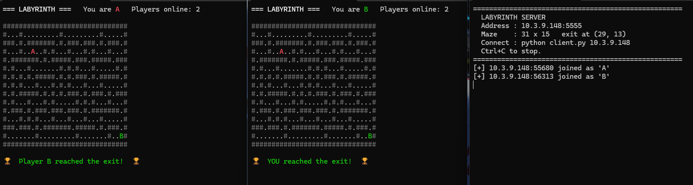

Here's the README as plain text — just copy everything below and save it as `README.md`:

# Labyrinth Multiplayer 🏰

A tiny, dependency-free **LAN multiplayer maze game** written in pure Python.
One machine runs the server, everyone else connects with the client — race
through a randomly generated labyrinth and be the first to reach the exit.

---

## ✨ Features

- 🎲 **Randomly generated maze** every time the server starts (recursive backtracker)
- 👥 **LAN multiplayer** — no internet, no accounts, no matchmaking
- ⚡ **Zero dependencies** — just the Python standard library
- 🎨 **Colored terminal rendering** with a unique symbol & color per player
- 🏆 **First to the exit wins** — the server locks further moves and announces the winner
- 🧵 **Thread-safe** — one thread per client, one global lock, full-state broadcast after each move

---

## 📦 Requirements

- Python **3.8+** (nothing else — no `pip install` needed)
- All players on the **same local network** (Wi-Fi or Ethernet)
- A terminal that supports ANSI colors
  - ✅ Windows Terminal, PowerShell 7+, macOS Terminal, Linux terminals
  - ⚠️ Old `cmd.exe` may render colors oddly — use Windows Terminal instead

---

## 🚀 Quick Start

### 1. Start the server (one machine only)

    python server.py

You'll see something like:

    ====================================================
      LABYRINTH SERVER
      Address : 192.168.1.10:5555
      Maze    : 31 x 15   exit at (29, 13)
      Connect : python client.py 192.168.1.10
      Ctrl+C to stop.
    ====================================================

> 💡 On the first run, Windows/macOS may ask to allow incoming connections.
> Say **yes**, or other machines can't reach port `5555`.

### 2. Connect from each player's machine

    python client.py 192.168.1.10

Use the IP that **your server printed** — not the one in this example.

That's it. The maze appears and you're playing.

---

## 🎮 Controls

| Key | Action |
|-----|--------|
| `W` | Move up |
| `A` | Move left |
| `S` | Move down |
| `D` | Move right |
| `Q` | Quit |

You're shown as a **bold** colored letter. Other players show up in their own colors.

---

## 🧪 Try It Solo First

You can test the whole thing on a single machine before inviting friends:

    # Terminal 1
    python server.py

    # Terminal 2
    python client.py 127.0.0.1

    # Terminal 3 (optional) — a second fake player
    python client.py 127.0.0.1

---

## 🖼️ How It Looks

    ╔══════════════════════════════════════════╗
    ║  You are 'B'   Players online: 3         ║
    ║                                          ║
    ║  #############################           ║
    ║  #A....#.......#.............#           ║
    ║  #.###.#.#####.#.###########.#           ║
    ║  #.#...#.....#.#.#.........#.#           ║
    ║  #.#.#######.#.#.#.#######.#.#           ║
    ║  #...#.......#...#.#.....#...#           ║
    ║  #.#.#.#########.#.#.###.#.#.#           ║
    ║  #.#.#...........#.#.#...#.#.#           ║
    ║  #.#.###############.#.###.#.#           ║
    ║  #B..#...........#...#...#...#           ║
    ║  #.#####.#######.#.###.#.###.#           ║
    ║  #.....#.....#...#...#.#...#.#           ║
    ║  #.###.#.###.#.###.#.#.#.#.#.#           ║
    ║  #...#...#...#...#...#...#..E#           ║
    ║  #############################           ║
    ║                                          ║
    ║  Move: W A S D     Quit: Q               ║
    ╚══════════════════════════════════════════╝

       # = wall        . = floor        E = exit
       A, B, C… = players (your own letter is bold)

---

## 📁 Files

| File | Purpose |
|------|---------|
| `server.py` | Generates the maze, listens on port `5555`, tracks players, enforces the win condition |
| `client.py` | Connects to the server, renders the maze, sends your keypresses |

---

## ⚙️ Configuration

A few constants at the top of `server.py` are worth tweaking:

| Constant | Default | Notes |
|----------|---------|-------|
| `PORT`   | `5555`  | Change if it clashes with something else on your LAN |
| `W`, `H` | `31`, `15` | Maze size. **Keep both odd** or the generator may misbehave |
| `SYMBOLS`| `A–Z 0–9` | Player symbols, assigned in join order |

If you change `PORT`, update the matching value in `client.py` too.

---

## 🛠️ How It Works (Short Version)

1. The server generates a maze using a **recursive backtracker**.
2. Each connecting client gets a **thread**, a spawn cell, and a symbol (`A`, `B`, …).
3. Every keypress is sent as a single character over TCP.
4. The server validates the move (in bounds? not a wall? game not over?), updates
   the player's position, and **broadcasts the full game state** to everyone.
5. Reaching cell `(W-2, H-2)` sets the winner, and further moves are ignored.

Simple, synchronous, and fast enough for a LAN game with a handful of players.

---

## ❓ Troubleshooting

**`Could not connect to <ip>:5555`**
- Double-check you're using the IP the server printed.
- Make sure both machines are on the same Wi-Fi/Ethernet network.
- Allow Python through your firewall (both on the server machine).

**Colors look wrong / garbled**
- Use Windows Terminal, PowerShell 7+, or any modern terminal.

**`python` not found**
- Try `python3` instead (common on macOS/Linux).

**Client hangs on "Waiting for maze..."**
- The server isn't reachable. Same firewall/IP checks as above.

---

## 📜 License

MIT — do whatever you want with it.

---

## 🙌 Contributing

This is a tiny hobby project. If you want to add features (spectator mode,
timed rounds, chat, a scoring system), feel free to open a PR or fork it.

---

LABYRINTH MULTIPLAYER — HOW THE NETWORKING WORKS
================================================

A short, plain-English walkthrough of what happens on the wire when you
play. No frameworks, no libraries — just Python's `socket` and `threading`.

1. THE BIG PICTURE
------------------

One machine is the SERVER. Everyone else is a CLIENT.

    +---------------------+
    |   SERVER MACHINE    |
    |   server.py         |
    |   192.168.1.10:5555 |
    +----------+----------+
               |
        LAN (Wi-Fi / router)
               |
    +----------+----------+----------+----------+
    |                     |                     |
    v                     v                     v
+--------+            +--------+            +--------+
| CLIENT |            | CLIENT |            | CLIENT |
|    A   |            |    B   |            |    C   |
+--------+            +--------+            +--------+

The server is the single source of truth. Clients never talk to each
other directly — everything goes through the server.

2. WHY TCP, AND WHY ONE PORT?
-----------------------------

TCP is used because the game needs reliable, ordered delivery. If a
keypress arrives late or out of order, the player's position would
desync. TCP guarantees both.

Port 5555 is just a default. It's a "high port", meaning no admin
privileges are needed to bind it, and it's unlikely to clash with
anything else on a normal home LAN.

Only ONE port is needed because the same TCP connection carries both
directions of traffic (client → server keypresses, server → client
game state). This is called a full-duplex connection.

3. THE WIRE FORMAT
------------------

Every message is one line of JSON, terminated by a newline character
(\n). This is a common trick called "newline-delimited JSON" — it lets
the receiver know exactly where one message ends and the next begins.

Why JSON?
  - Human-readable if you ever need to debug.
  - Built into the Python standard library (`json` module).
  - Easy to extend later (add fields without breaking old clients).

Example messages travelling over the wire (each one is a single line):

CLIENT → SERVER  (just a single letter + newline):

    w
    a
    s
    d

SERVER → CLIENT  (initial handshake, sent once after connecting):

    {"type":"init","id":2,"sym":"C","width":31,"height":15,
     "maze":["###############", "#...#.........#", ...],
     "exit":[29,13],"winner":null}

SERVER → CLIENT  (broadcast after EVERY move, sent to all players):

    {"type":"state","players":{"0":[1,1,"A"],"1":[5,9,"B"],
     "2":[12,4,"C"]},"winner":null}

SERVER → CLIENT  (only if something went wrong):

    {"type":"error","msg":"No free spawn point."}

4. THE HANDSHAKE (when a client first connects)
-----------------------------------------------

    CLIENT                                  SERVER
      |                                       |
      |  TCP connect to 192.168.1.10:5555 -->  |  accept()
      |                                       |  spawn a new thread
      |                                       |  pick_spawn() for a free cell
      |                                       |  assign next symbol (A, B, C...)
      |                                       |  add to players{} dict
      |  <-- {"type":"init", maze, exit, ...}  |  send()
      |                                       |
      |  (client renders the maze)            |  broadcast state to everyone
      |                                       |  (so existing players see the new one)

After this, the client enters its main loop and never needs to
re-handshake. The connection stays open for the entire session.

5. WHAT HAPPENS WHEN YOU PRESS A KEY
------------------------------------

    You press 'd'
       |
       v
    client.py's input_loop() reads a line from stdin
       |
       v
    sends the 2-byte string "d\n" over the TCP socket
       |
       v
    SERVER's per-client thread wakes up in recv()
       |
       v
    parses "d" → looks up in DIRS = {"d": (1, 0)}
       |
       v
    do_move(pid, "d"):
       - acquire the global lock
       - is the game already over? if yes, ignore.
       - compute new position (x+1, y)
       - is it out of bounds? is it a wall (#)? if yes, ignore.
       - update players[pid]["x"] and ["y"]
       - did we reach (W-2, H-2)? if yes, set winner.
       - release the lock
       |
       v
    broadcast(): builds a "state" message with every player's
    position, then sends it to every connected client's socket.
       |
       v
    Every client receives the new state and redraws the maze.
    You see yourself (bold) move one cell to the right.

6. WHY A GLOBAL LOCK?
---------------------

Each client runs in its own thread on the server. Without a lock,
two players moving at the same instant could race each other:

    Thread A reads players[0]["x"] = 5
    Thread B reads players[0]["x"] = 5
    Thread A writes players[0]["x"] = 6
    Thread B writes players[0]["x"] = 6   <-- lost update!

The global lock (`threading.Lock()`) ensures only one thread touches
the shared game state at a time: the maze, the players dict, and the
winner variable. Every read-modify-write sequence is wrapped in
`with lock: ...`.

Broadcasting happens outside the lock (or with a snapshot copied
under it) so a slow client can't freeze the whole game.

7. HOW DISCONNECTS ARE HANDLED
------------------------------

The server's per-client loop looks like this (simplified):

    while True:
        data = conn.recv(1024)
        if not data:
            break    # client closed the connection (or network died)
        ...process...

When a client quits (or their laptop sleeps, or Wi-Fi drops), recv()
returns an empty bytes object. The server:
  1. exits the loop
  2. removes that player from players{}
  3. broadcasts the new state to everyone else
  4. closes the socket

Other players see the departed player's letter disappear on their
next redraw. No special "goodbye" message is needed — TCP's clean
shutdown handles it.

8. WHY THIS DESIGN IS GOOD FOR A LAN GAME
-----------------------------------------

  - Latency on a LAN is typically <5 ms, so broadcasting full state
    after every single move is completely fine. No need for deltas,
    interpolation, or client-side prediction.

  - Full-state broadcasts mean clients are stateless renderers.
    They don't need to "remember" anything between frames — they
    just draw whatever the server last told them. This makes the
    client code trivially simple.

  - Newline-delimited JSON means the protocol is debuggable by hand.
    You can literally `telnet 192.168.1.10 5555` and type commands
    to see what the server sends back.

  - No central coordinator process, no ports to forward, no NAT
    traversal, no UDP hole-punching. Just plain sockets on one port.

9. WHAT IT IS NOT
-----------------

This is deliberately simple. It does NOT have:

  - Authentication (anyone on the LAN can connect)
  - Encryption (traffic is plaintext on the wire)
  - Reconnection (drop the connection, you rejoin as a new player)
  - Lag compensation (irrelevant on a LAN)
  - Anti-cheat (the server validates moves, but trusts the client's
    intent — which is fine for a game among friends)

If you want any of those, you'd reach for a real networking library
(websockets, asyncio, an ECS framework, etc.). For a hobby LAN game
though, this trade-off is exactly right: minimal code, maximum clarity.

10. QUICK REFERENCE
-------------------

Direction    Packet sent     Server action             Result
---------    -----------     -------------             ------
W            "w\n"           y - 1                     move up
A            "a\n"           x - 1                     move left
S            "s\n"           y + 1                     move down
D            "d\n"           x + 1                     move right
Q            (no packet)     client just closes        player leaves

Server → all      "state" message: every player's position
Server → new      "init" message:  maze + your id + exit + symbol
Server → error    "error" message: rare, only on connect failure

Symbols A–Z 0–9 are assigned by join order. First player gets 'A',
second gets 'B', and so on. Color is derived from the symbol, so
every player always sees the same color for the same letter.